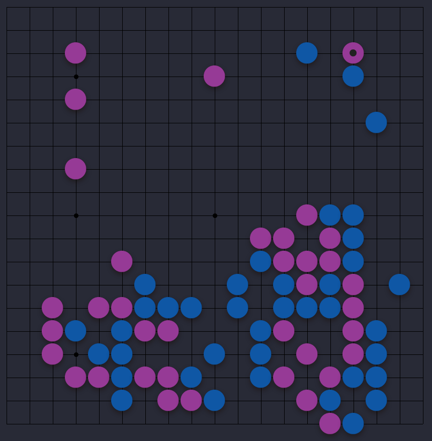
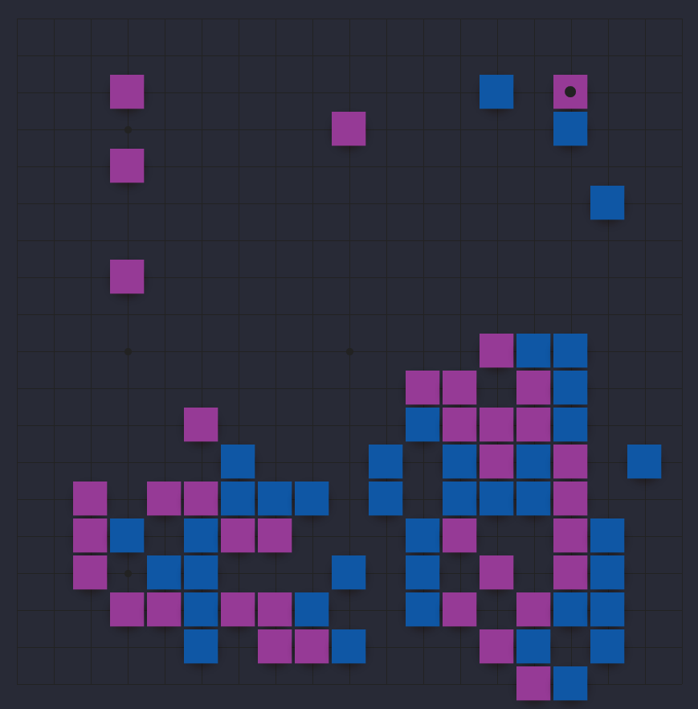
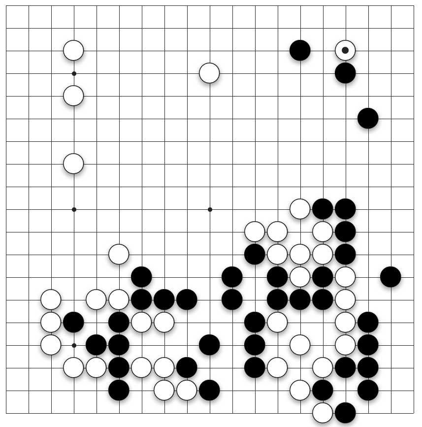
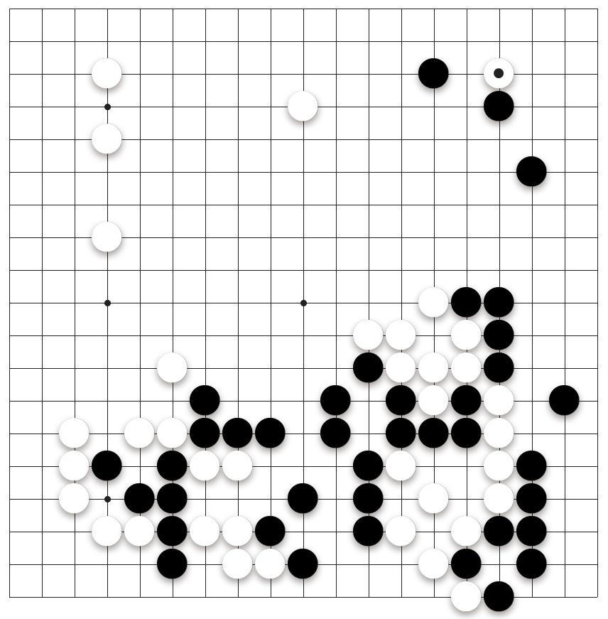
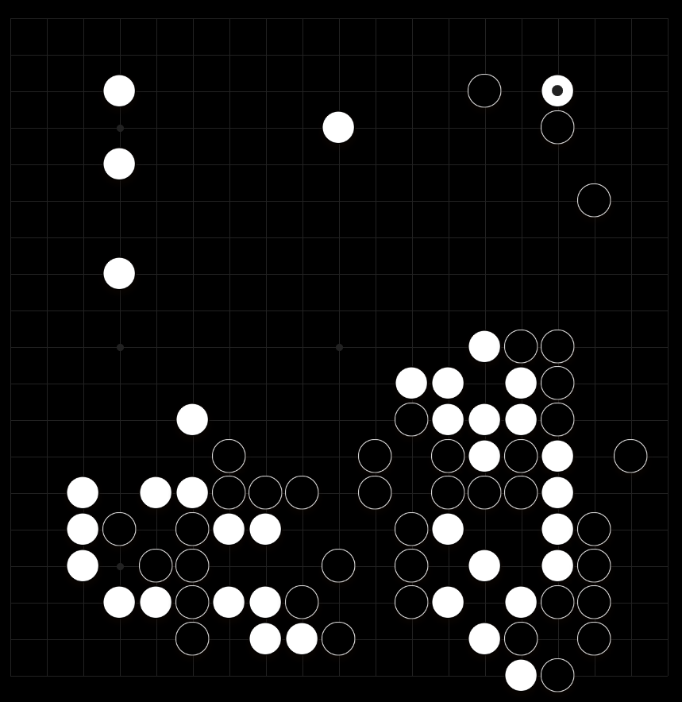
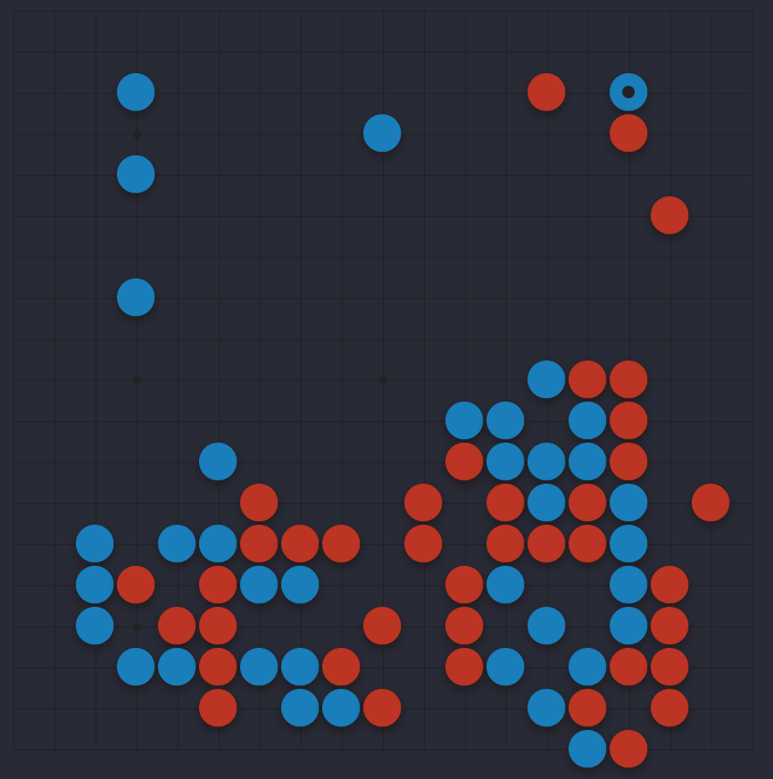
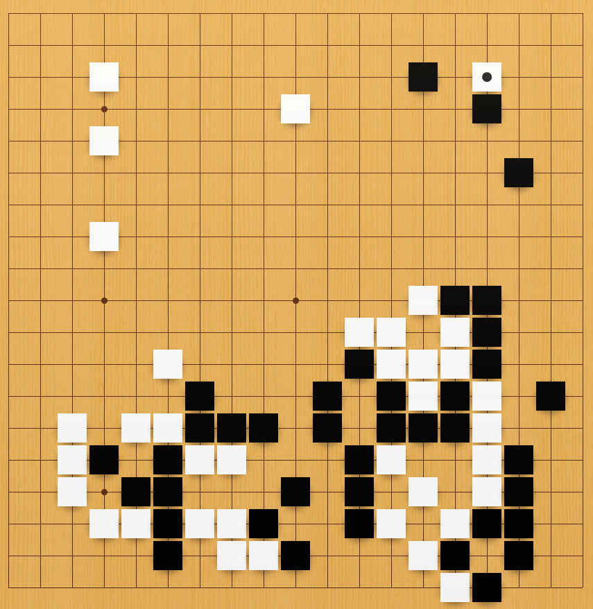

# Fanaro's Sabaki Theme Collection

> This collection is still under construction. And, at any rate, even if you think some of the themes are *bad*, they still serve the purpose of illustrating bad practices &mdash; like too much constrast.

Some more variants and themes for having a more lively Go experience.

Unexpectedly, having a dark goban is actually refreshing. Even though we don't see the lines as easily, it becomes clear that they are not that necessary, as most of the time we place stones relative to one another. Not having to pay that much attention to lines is quite liberating and leaves a cleaner design. However, it is true that neon/oversaturated colors can tire the eyes much more easily; in that case, choose a dark theme with less saturated colors.

> I haven't yet been able to incorporate Sabaki background images into the themes themselves. So far, I've been using the `backgrounds` folder to manage that.

Some of my inspirations are:

- The [Dracula &mdash; or Darcula &mdash;](https://draculatheme.com/) text editing theme.
- The [Color Go Server (CGS)](https://colorgoserver.com/).
    - Maybe someone could directly extract the theme goodness they have there? Maybe directly contact their devs?

## References

- The documentation on how to create and package a theme can be found [here](https://github.com/SabakiHQ/Sabaki/blob/master/docs/guides/create-themes.md).
- Sabaki's CSS styling can be found [here](https://github.com/SabakiHQ/Shudan/tree/master/docs#styling).
- A good example of a theme is the fantastic [Photorealistic theme](https://github.com/SabakiHQ/theme-photorealistic), by Yichuan Shen himself.

## Debugging Tips

- Sabaki seems to cache the `.asar` file if it has the same name as the previously loaded one. So, if you make a modification to an element and repackage the whole theme with the same name, the modification might not appear on Sabaki. To avoid this:
    1. Uninstall your current theme.
    1. Close Sabaki.
    1. Reopen Sabaki and reinstall your theme.

## Standard Organization

The organization of my themes reflects the one found in the Photorealistic theme:

- `projects/`: where I store the files intended to be manipulated with GUI image editors, like Adobe Illustrator, GIMP, Inkscape, etc.
- `theme/`: where the theme is.
- `theme/img/`: where you will find the `.png` files with the final form of the assets.
- `theme/style.css`: the CSS styling of the theme.
- `theme/package.json`: the metadata for the theme.
- `<theme>.asar`: the binary with the packaged theme.

## Themes

The screenshots below were taken from the game between [Shibano Toramaru 9p and Hane Naoki 9p, on 2021-04-02](http://go4go.net/go/games/sgfview/96076) &mdash; the file can be found inside the [assets/](assets/) folder.

| Theme                 | Example                                                         |
| --------------------- | --------------------------------------------------------------- |
| Bluish Purple         |                  |
| Bluish Purple Squared |  |
| Bookish               |                              |
| Bookish No Border     |          |
| Reverse Bookish       |              |
| Fire & Ice            |                    |
| Squared               |                              |
